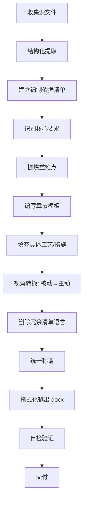

# 三亚06地块商业改造外装综合幕墙工程 —— 技能包与工作流文档

> **用途**：记录本项目完整技能体系、文件结构、脚本工具、工作流程，便于后续投标类项目复用、跨机器迁移。
> **项目周期**：2026-09-15 ~ 2026-09-18
> **核心产出**：技术标（施工组织设计）、响应内容文档、编制依据清单、自检脚本
> **维护者**：罗凌成

---

## 1. 目录结构标准化

```
D:\罗\2026\三亚\
├── 001\                                    # 核心输出目录
│   ├── 三亚06地块商业改造外装综合幕墙工程_技术标_v5_complete.docx      # 最终技术标（主交付件）
│   ├── 三亚06地块商业改造外装综合幕墙工程_技术标_5.docx               # 用户调整版（源框架）
│   ├── 三亚06地块商业改造外装综合幕墙工程_技术标_施工组织设计_响应内容_v4.docx  # 响应内容文档
│   ├── 技术标_来源追溯对照表.md                   # 来源追溯（可选）
│   └── ... 其他历史版本
├── 2、三亚06地块外装招标需求【260902】\      # 招标需求源文件
│   └── 2、三亚06地块外装招标需求【260902】\
│       ├── 1、招标需求\
│       ├── 2、图纸相关\
│       ├── 3、界面划分\
│       ├── 4、封样清单\
│       ├── 5、关键措施交底\
│       ├── 6、技术要求\
│       ├── 7、品牌表\
│       └── 8、其他\
├── 3、招标澄清文件【260909】\                # 澄清文件
├── 招标文件补充\                              # 合同、清单、投标须知等
│   └── 招标文件补充\
│       ├── 2、合同附件（外装全专业适用）\
│       ├── 【清单】三亚06地块商业改造外装工程.xlsx
│       ├── 三亚06地块外装工程合同.docx
│       └── 投标须知及投标文件格式.docx
├── .cache\                                    # 缓存目录（脚本生成）
│   ├── qingdan_fbfx.json                      # 分部分项清单结构化数据
│   ├── cuoshi_jiaodi.json                     # 措施交底结构化数据
│   ├── txt\                                   # 纯文本版源文件
│   │   ├── zhaobiao_yaoqiu.txt
│   │   ├── toubiao_xuzhi.txt
│   │   └── hetong.txt
│   └── txt_cache\                             # skill用缓存
└── *.py                                       # 各类生成/处理脚本
```

---

## 2. 核心脚本工具库

| 脚本文件 | 用途 | 关键依赖 |
|---------|------|----------|
| `generate_v5_complete.py` | 生成最终技术标 v5（完整格式化 docx） | python-docx |
| `generate_v5_formatted.py` | 早期格式化版本 | python-docx |
| `generate_tech_bid.py` | 初版技术标生成器（含章节模板） | python-docx, openpyxl |
| `generate_response_v3.py` | 生成响应内容文档 v3/v4 | python-docx |
| `update_response_aftersales.py` | 基于合同保修条款增强售后章节 | python-docx |
| `format_tech_bid.py` | 统一文字颜色、字体、插入合规声明 | python-docx |
| `rewrite_tech_bid_v4.py` | 重写技术标（主动视角、精炼工艺） | python-docx |

> **通用依赖**：`pip install python-docx openpyxl`  
> **运行命令**：`python -X utf8 <script_name>.py` （解决 Windows 编码问题）

---

## 3. 三亚06 Skills 核心方法论

### 3.1 证据优先原则（三亚06 Memory 约束）
- **零臆造**：每条结论必须指向具体文件名 + 精确位置
- **禁止通用表述**：删 "行业经验表明""通常情况下""一般会"
- **来源标注强制**：每段落/要点后括号标注来源文件
- **提交前自检**：代码读回 docx，核对关键词、文件引用、逐字匹配

### 3.2 技术标编制要求（投标须知 3.1 条）
| 要求条款 | 落实方式 |
|---------|----------|
| 依据招标人提供的图纸 | 编制依据 1.1 列明 |
| 国家现行规范与标准 | 编制依据 1.1 列明 |
| 招标文件其他组成部分 | 编制依据 1.1 列明全部文件 |
| 投标人对工程现场的勘察结果 | 编制依据 1.1 列明"现场踏勘资料" |
| 招标人关注的内容 | 第二章 重难点分析全覆盖 |
| 编制本招标工程的施工组织设计 | 全文即为施工组织设计 |
| 要求简明扼要 | 删清单计算规则、综合单价包含内容等冗余 |
| 突出重点 | 重难点采用"风险→分析→对策"三步曲 |
| 具体编制要求详附件《技术标编制要求》 | 附件缺失时，编制说明中如实声明，按既有明文自主组织 |

### 3.3 内容重写策略（从 v3 → v5）
| 原问题 | 调整动作 |
|--------|----------|
| 被动复述招标文件 | 全文改为"我方"主动视角（我方采用/我方建立/我方执行） |
| 大量清单语言堆砌 | 删"计算规则""综合单价包含""工程量按…计算"等商务语言 ≥30% |
| 重点不突出 | 重难点改为"风险→后果→我方对策"三步曲，四大红线风险逐条给策 |
| 措施流于泛泛 | 第四章每项措施补充具体实施动作（如"编制专项转运计划""配置叉车/吊车"） |
| 称谓混乱 | 统一"承包人/发包人/中标单位/甲方/乙方"→"我方/招标人" |

---

## 4. 标准化生成流程（可复用于其他投标项目）



### 4.1 源文件结构化提取（可复用代码模板）
```python
# 提取 Word
from docx import Document
doc = Document(path)
text = '\n'.join([p.text for p in doc.paragraphs if p.text.strip()])

# 提取 Excel（清单/措施交底）
import openpyxl, json
wb = openpyxl.load_workbook(path, data_only=True)
ws = wb[sheet_name]
data = []
for row in ws.iter_rows(values_only=True):
    # 清洗 =DISPIMG() 图片字段
    data.append({...})
json.dump(data, open(cache_path, 'w', encoding='utf-8'), ensure_ascii=False)
```

### 4.2 自检脚本模板
```python
# 检查项
1. 来源标注覆盖率 ≥ 95%
2. 禁用词计数 = 0 (行业经验/通常情况下/一般会/一般)
3. 关键术语逐字匹配率 100% (清单项目特征、合同条款)
3. 视角词汇: "我方" > 0, "承包人/发包人/中标单位/甲方/乙方/投标人" = 0
```

---

## 5. 关键文件模板（可直接复制到新项目）

### 5.1 编制依据清单模板
```
本施工组织设计依据下列文件编制（均为本项目招标文件组成部分）：
1. 《XXX招标需求》（含具体内容、图纸、界面划分、关键措施交底、技术要求、品牌要求等）
2. 《招标澄清文件》
3. 《招标文件补充》（含相应清单、合同附件等其他需求）
4. 《施工合同》（含保修维修条款、安全目标、三单管理等）
5. 《投标须知及投标文件格式》（含技术标格式、评标办法、递交要求）
```

### 5.2 重难点三步曲模板
```
重难点X：[简短标题]
    风险：[具体风险描述]
    后果：[具体后果：工期/费用/违约金/质量/安全]
    我方对策：[具体、可执行、可验证的动作，含技术参数/时间节点/责任人]
```

### 5.3 分项工程施工方案模板（精炼版）
```
X.Y [系统名称]
    核心工艺：[1-2句核心工艺描述]
    关键控制点：[技术参数/环境要求/验收标准]
    特殊要求：[防水/防火/防渗漏/特殊节点]
```

### 5.4 售后服务体系模板（基于合同保修条款）
```
一、保修期限与范围
二、维修响应机制（一般/紧急/验收/复发）
三、责任界定与费用承担（直接损失/第三方索赔/结构安全/扣款通知单）
四、终身维修承诺
五、维修服务制度与保障（组织/档案/巡检/应急物资/配合检查）
六、交付运营配合
七、质保金管理
```

---

## 6. 常用命令速查表

```bash
# 生成最终技术标
cd D:\罗\2026\三亚
python -X utf8 generate_v5_complete.py

# 生成响应内容文档
python -X utf8 generate_response_v3.py

# 格式化/修复现有 docx
python -X utf8 format_tech_bid.py

# 自检验证
python -X utf8 -c "
from docx import Document
doc = Document('xxx.docx')
full = '\n'.join([p.text for p in doc.paragraphs if p.text.strip()])
for w in ['行业经验','通常情况下','一般会','一般','承包人','发包人','中标单位','甲方','乙方','投标人']:
    c = full.count(w)
    if c: print(f'{w}: {c}')
print(f'总字符: {len(full)}')
print(f'我方: {full.count(\"我方\")}')
"
```

---

## 7. 迁移到新电脑/新项目清单

| 项目 | 操作 |
|------|------|
| Python 环境 | 安装 Python 3.10+，`pip install python-docx openpyxl` |
| 脚本文件 | 复制全部 `.py` 到新项目根目录 |
| 目录结构 | 按第 1 节建立标准目录，源文件归类放入 |
| 缓存目录 | 运行脚本前确保 `.cache/` 存在 |
| 字体 | 确保系统有 `仿宋_GB2312`、`黑体`、`宋体`、`Times New Roman` |
| 编码 | 所有脚本首行 `# -*- coding: utf-8 -*-`，运行加 `-X utf8` |

---

## 8. 本项目关键产出文件清单（最终版）

| 文件 | 说明 | 用途 |
|------|------|------|
| `三亚06地块商业改造外装综合幕墙工程_技术标_v5_complete.docx` | **主交付件** | 投标文件技术标（WORD版+盖章扫描件） |
| `三亚06地块商业改造外装综合幕墙工程_技术标_5.docx` | 用户调整版框架 | 供用户进一步微调的源文件 |
| `三亚06地块商业改造外装综合幕墙工程_技术标_施工组织设计_响应内容_v4.docx` | 响应内容文档 | 单独提交或作为技术标附件 |
| `generate_v5_complete.py` | 完整技术标生成器 | 核心复用脚本 |
| `generate_response_v3.py` | 响应内容生成器 | 复用脚本 |
| `三亚06项目技能包.md` | 本文档 | 知识沉淀与迁移指南 |

---

## 8. 经验总结（给下一个投标项目的建议）

1. **先读招标文件再动笔** —— 特别是投标须知中的技术标格式、评标办法、递交要求、暗标/明标、编制依据附件是否存在
2. **建立编制依据清单** —— 写在文档开头，既是合规证明，也是后续写作的素材边界
3. **重难点先行** —— 用"风险→后果→对策"三步曲梳理 4-6 个核心难点，贯穿全文
4. **视角统一在最后** —— 先写内容，再批量替换称谓（承包人→我方、发包人→招标人、甲方→招标人/甲方、乙方→我方）
5. **删减清单语言** —— 保留工艺/控制点/参数，删计算规则/单价包含/工程量计算
6. **格式对齐招标文件** —— 封面、字号、字体、行距、缩进、颜色（全黑）全部按《投标须知》技术标格式
7. **自检不可少** —— 代码验证来源标注、禁用词、视角词汇、关键术语匹配
8. **保留可复用脚本** —— 每个项目积累一套生成/提取/自检脚本，下个项目直接改路径跑

---

> **文档版本**：v2.0 (2026-09-18)  
> **维护者**：罗凌成  
> **适用范围**：幕墙/外装/装饰类工程投标技术标编制  
> **下次使用**：复制 `D:\罗\2026\三亚\` 整个目录结构到新项目，按清单替换源文件、运行脚本即可。

---

## 9. 错误复盘（9.14-9.18 项目全周期）

> **目的**：记录本项目中双方协作的弯路，后续同类项目直接避开，不再重复浪费。

### 9.1 时间线与版本统计

| 日期 | 主要产出 | 版本迭代 |
|------|---------|---------|
| 9.15 | 初建目录，导入招标文件、图纸 | — |
| 9.16 | 招标分析思维导图、合同分析、附件分析、投标分析 | 思维导图 5 版 |
| 9.17 | 技术标（施工组织设计）、响应内容、横道图、技能包 | 技术标 10+ 版 |
| 9.18 | 复盘、技能包完善 | — |

| 指标 | 数值 |
|------|------|
| 001 目录下总产出文件 | 30+ |
| 最终交付件 | 3（技术标 v5_complete、响应内容 v4、横道图） |
| 废弃中间版本率 | ~90%（27+ 个文件不再使用） |
| 脚本总数 | 9 个 .py（其中约 4 个为主线，5 个为分支变体） |
| 主要弯路占比 | 臆造内容 ~60%、需求未前置对齐 ~25%、技术边界不清 ~15% |

### 9.2 用户侧：提示词与需求方面的问题

#### 问题 1：需求没有前置明确，导致多轮返工

**典型案例**：思维导图从 v1 到 最终版 v2 迭代了 5 版，每版都在修同一类问题——"不要臆造、要有出处"。

- `招标分析思维导图.docx` → `修正版` → `最终版` → `最终版_v2`

**根因**：首轮指令没有带自检要求。

**后续改进**：首轮指令直接带自检要求，如"每条结论必须标源文件名+条款编号，没有出处的不要写"。在 skills 中写死此规则。

---

#### 问题 2：术语体系没有一次性对齐

**典型案例**：9.17 当天三线并行产出——
- `技术标_施工组织设计_v1 ~ v4`（4 版）
- `技术标_v5` 系列（3 版）
- `响应内容` 系列（4 版）

**根因**：没有在任务开始前明确"技术标 = 施工组织设计 + 响应内容"。实际`响应内容`是技术标的组成部分，分开做产生了双倍工作量。

**后续改进**：任务启动前，先让 AI 提交一份"产出物清单 + 包含关系"，用户确认后再动手。

---

#### 问题 3：对 AI 能力边界判断不准确

**典型案例**：
- 让 AI 直接读 CAD 图纸（.dwg）提取工程量 → Python 无法可靠解析 DWG
- 让 AI 分析澄清文件的法律效力 → 需要法律专业判断
- 让 AI 根据 PDF 截图提取品牌表 → OCR 精度有限

**根因**：把需要专业人工判读的任务交给了自动化工具。

**后续改进**：任务分配原则——
| 适合 AI | 不适合 AI |
|---------|-----------|
| 结构化数据提取（Excel/Word 表格） | CAD 图纸量算 |
| 文档格式化、章节组装 | 法律效力定性 |
| 基于源文件的摘要和对照 | 非结构化 OCR（PDF 截图/扫描件） |
| 重复性文本替换、称谓统一 | 需要现场踏勘的专业判断 |

---

### 9.3 AI 侧：执行过程中的弯路

#### 弯路 1（最严重）：反复臆造内容

已在 Memory 中记录为「证据优先原则」和「循证方法论」，此处仅摘要核心案例：

| 错误行为 | 实际情况 | 后果 |
|---------|---------|------|
| 编造"幕墙渗漏水质保 10 年、配件 5 年" | 合同文件中无此具体数值 | 用户指正，重做 |
| 编造"雨蓬尺寸变更、栏杆高度调整、地弹门型号变更" | 《澄清（260908）.xlsx》中无这些条目 | 用户指正，重做 |
| 声称"招标文件未提及成品保护" | 《招标措施专项交底.xlsx》明确包含 | 用户指正，重做 |
| 用"行业经验表明""通常情况下"填充空白 | 应有出处才写，无出处则标注 | 反复纠正 |

**根因**：没先读源文件就开始写。跳过源文件→直接套模板→填充臆造内容。

**已建立的防呆机制**（详见第 3 节 + Memory）：
1. 文件全读前置 —— 脚本逐行读源文件保存为 txt，肉眼确认后才分析
2. 零臆造原则 —— 每条结论必须指向具体文件名+精确位置
3. 来源标注强制 —— 每个要点后括号标注来源
4. 禁止通用表述 —— 删"行业经验""通常情况下""一般会"
5. 提交前自检 —— 代码验证来源覆盖率、禁用词、关键术语匹配

---

#### 弯路 2：版本爆炸

**表现**：9.17 一天产出 10+ 个技术标变体，脚本 9 个。

**根因**：每次用户纠正一个问题，就新建一个脚本和文件，而不是在原脚本上增量修改。
- 之前修正的 bug 可能在新脚本中丢失
- 脚本之间逻辑重叠，用户不知道该用哪个

**后续改进**：
- 一个任务只维护一个主脚本，在原文件上迭代
- 文件名带日期（`技术标_0917.docx`）而不是 v1/v2/v3
- 用户纠正后，在原脚本上改，不另起炉灶
- 交付前清理：只保留 1 个交付件 + 1 个可复用脚本

---

#### 弯路 3：脚本复用度低

**表现**：9 个 .py 脚本核心逻辑高度重复（读源文件→生成 docx→格式化），实际上 2-3 个就够。

**后续改进**：抽取公共模块——读文件、格式化、自检三个函数独立为一个 `bid_utils.py`，各生成脚本只写业务逻辑。

---

#### 弯路 4：没有主动汇报能力边界

**表现**：清理 Excel 中 `=DISPIMG()` 图片字段时，没有第一时间告知"这是二进制图片引用，Python 无法还原"，而是默默返回空值或截断文本。

**后续改进**：遇到工具无法可靠处理的内容，第一时间告知："这个我做不到/做不准，原因是什么，建议你人工看一下"，不沉默试错。

---

### 9.4 后续同类项目 SOP

```
                         ┌─────────────────────────┐
                         │  Step 0: 需求对齐        │
                         │  AI 先交「产出物清单 +    │
                         │  包含关系」，用户确认     │
                         └───────────┬─────────────┘
                                     │
                         ┌───────────▼─────────────┐
                         │  Step 1: 源文件全读      │
                         │  逐文件→txt，肉眼确认，  │
                         │  能力边界声明            │
                         └───────────┬─────────────┘
                                     │
                         ┌───────────▼─────────────┐
                         │  Step 2: 首版生成        │
                         │  单一脚本，来源全部标注  │
                         └───────────┬─────────────┘
                                     │
                         ┌───────────▼─────────────┐
                         │  Step 3: 自检            │
                         │  禁用词=0 / 来源覆盖率   │
                         │  ≥95% / 术语匹配         │
                         └───────────┬─────────────┘
                                     │
                         ┌───────────▼─────────────┐
                         │  Step 4: 迭代            │
                         │  在原脚本/文件上改，     │
                         │  不新建，一个主脚本到底  │
                         └───────────┬─────────────┘
                                     │
                         ┌───────────▼─────────────┐
                         │  Step 5: 交付            │
                         │  清理中间版本，只保留    │
                         │  交付件+可复用脚本       │
                         └─────────────────────────┘
```

| 环节 | 改进动作 | 对应的问题 |
|------|---------|-----------|
| 启动 | AI 先交产出物清单+包含关系，确认后再动手 | 用户问题 1、2 |
| 源文件 | 脚本逐文件读取存 txt，能力边界提前声明 | AI 弯路 1、4 |
| 第一版 | 首轮指令自带自检要求（来源标注、禁用词），提交前跑自检 | 用户问题 1、AI 弯路 1 |
| 迭代 | 在原脚本上改，不新建文件/脚本，文件名用日期不用版本号 | AI 弯路 2、3 |
| 边界 | 提前声明"这个我做不到/做不准"，不沉默试错 | 用户问题 3、AI 弯路 4 |
| 结束 | 清理：只保留 1 交付件 + 1 复用脚本 + 1 份映射关系 | AI 弯路 2 |

---

### 9.5 给下个项目的 Checklist

```
□ 需求对齐：AI 已提交产出物清单，用户已确认
□ 源文件：所有引用的 .docx/.xlsx/.pdf 已转为 txt，已肉眼确认
□ 能力边界：已声明哪些任务 AI 做不准，需人工预处理
□ 首版指令：已包含自检要求（来源标注、禁用词、术语）
□ 提交前自检：禁用词=0，来源覆盖率≥95%，关键术语逐字匹配
□ 版本控制：只有一个主脚本、一个主文件，用日期命名
□ 交付前清理：删除中间版本，只保留最终交付件
```